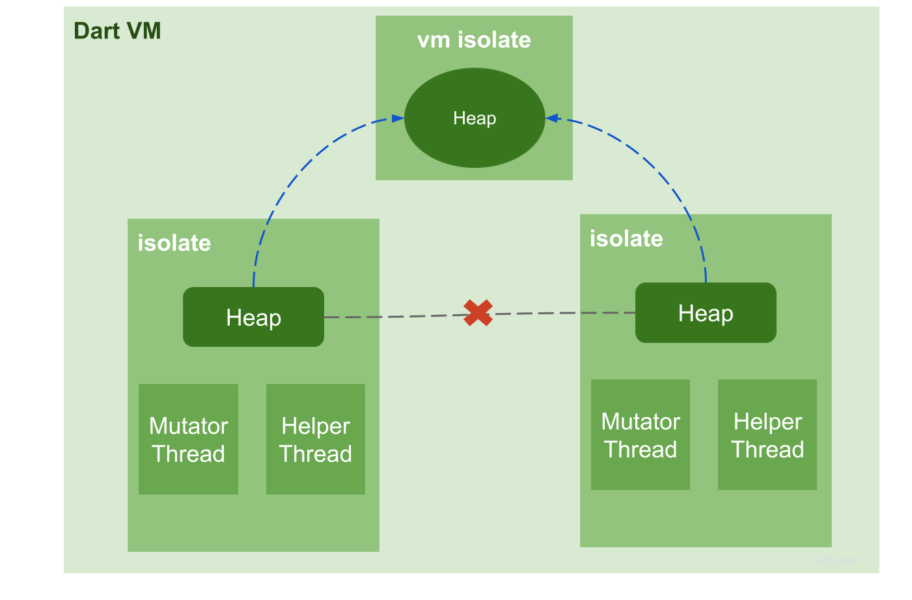

#### Dart语言

> Dart语言是Google开发的一种强类型 OOP语言（Object Oriented Programming，面向对象编程）,它继承了许多与 C、Java、JavaScript 及其他语言相同的语句和表达式语法

**既有动态语言特性，也有静态语言特性**
    
    - 动态语言，运行时检测类型，如python,类型发生错误在运行时才能发现
    
    - 静态语言，编译时检测类型，如java，类型发生错误在编译时发现

> dart 语言示例

```
// 定义一个方法.
printInteger(int aNumber) {
    // 打印输出到控制台。字符串插值,字符串字面量中包含的变量或表达式
  print('The number is $aNumber.');
}

// Dart 程序从 main() 函数开始执行。
main() {
 // 声明并初始化一个变量。
  var number = 42;
  // 调用一个函数。
  printInteger(number);
}
```

> dart 语言的一些概念

    - 所有变量引用的都是 对象，每个对象都是一个 类 的实例。数字、函数以及 null 都是对象。所有的类都继承于 Object 类
    - 尽管 Dart 是强类型语言，但是在声明变量时指定类型是可选的，因为 Dart 可以进行类型推断。
    在上述代码中，变量 number 的类型被推断为 int 类型。如果想显式地声明一个不确定的类型，可以使用特殊类型 dynamic
    - Dart 支持顶级函数（例如 main 方法），同时还支持定义属于类或对象的函数（即 静态 和 实例方法）。你还可以在函数中定义函数（嵌套 或 局部函数）
    - Dart 没有类似于 Java 那样的 public、protected 和 private 成员访问限定符。如果一个标识符以下划线 (_) 开头则表示该标识符在库内是私有的


#### Flutter是什么

**跨平台的UI框架**

- Fuchsia是Google内部正在开发的一款新的操作系统，从Fuchsia技术架构来看，内核层zircon的基础LK是专为嵌入式应用中小型系统设计的内核，代码简洁
，适合嵌入式设备和高性能设备，比如IOT、移动可穿戴设备等

> 跨平台技术的主要特点


    - 高效率：采用dart语言编写代码，虽然刚开始上手需要点时间，但熟练后效率比较高。一套代码适用多个平台(Android、iOS、Web)，以及高效的Hot Reload能快速辅助调试；
    - 动态化：2017年苹果，禁止JSPatch等 iOS App热更新方案，从此iOS动态化成为一个不宜公开讨论的话题。同样地，Flutter引擎在某一个官方版本对动态化做过一些尝试
    ，但后续基于风险考虑移除（不完美？）；
    - 一致性
    - 高性能

> flutter 是一款移动应用程序sdk，一份代码可以同时生成多种平台应用程序

    - 生成android apk，flutter build apk --build-number 41 --build-name 2.1.6
    
    - 生成 ios app，flutter build ios，生成app文件后，修改版本号再打包

#### Flutter怎么运行的

> 程序的运行方式：静态编译（Ahead of time）与动态解释（Just in time）

    - 静态编译的程序在执行前全部被翻译成机器码，即“提前编译”，代表语言java，C/C++
    - 动态解释的程序则是一边翻译一边运行，即“即时编译”，代表语言python
    
**通常我们区分是否为AOT的标准就是看代码在执行之前是否需要编译，只要需要编译，无论其编译产物是字节码还是机器码，都属于AOT**

> flutter属于静态编译还是动态编译？

    - Debug模式：对应了Dart的JIT模式，又称检查模式或者慢速模式。支持设备，模拟器(iOS/Android)，此模式下打开了断言，包括所有的调试信息，
    服务扩展和Observatory等调试辅助。此模式为快速开发和运行做了优化，但并未对执行速度，包大小和部署做优化。Debug模式下，编译使用JIT技术，
    支持广受欢迎的亚秒级有状态的hot reload。
      
    - Release模式：对应了Dart的AOT模式，此模式目标即为部署到终端用户。只支持真机，不包括模拟器。关闭了所有断言，
    尽可能多地去掉了调试信息，关闭了所有调试工具。为快速启动，快速执行，包大小做了优化。禁止了所有调试辅助手段，服务扩展。
    
> flutter 性能媲美native？


    - Android原生框架，通过调用Java Framework层，再调用到skia来渲染界面；
    - 其他跨平台方案(如RN)，通过JSBridge中间层来将JS写的APP转换成相应的原生渲染逻辑，可见比Native代码增加了更多逻辑，性能逊色差于原生框架；
    - Flutter框架，APP通过调用Dart Framework层，再直接调用到skia来渲染界面，并没有经过原生Framework过程，可见其渲染性能并不会弱于Native技术，这是一个性能上限很高的跨平台技术。

> flutter内存模型

- 何为Isolate，从字面上理解是“隔离”，isolate之间是逻辑隔离的。Isolate中的代码也是按顺序执行，
因为Dart没有共享内存的并发，没有竞争的可能性，故不需要加锁，也没有死锁风险。对于Dart程序的并发则需要依赖多个isolate来实现。



    - isolate堆是运该isolate中代码分配的所有对象的GC管理的内存存储
    - vm isolate是一个伪isolate，里面包含不可变对象，比如null，true，false
    - isolate堆能引用vm isolate堆中的对象，但vm isolate不能引用isolate堆
    - isolate彼此之间不能相互引用
    - 个isolate都有一个执行dart代码的Mutator thread，一个处理虚拟机内部任务(比如GC, JIT等)的helper thread；
    可见，isolate是拥有内存堆和控制线程，虚拟机中可以有很多isolate，但彼此之间内存不共享，无法直接访问，
    只能通过dart特有的Port端口通信；isolate除了拥有一个mutator控制线程，还有一些其他辅助线程，比如后台JIT编译线程、GC清理/并发标记线程；

> flutter 应用启动流程

    - FlutterApplication.java的onCreate过程主要完成初始化配置、加载引擎libflutter.so、注册JNI方法；
    - FlutterActivity.java的onCreate过程，通过FlutterJNI的AttachJNI()方法来初始化引擎Engine、Dart虚拟机、Isolate、taskRunner等对象。
    再经过层层处理最终调用main.dart中main()方法，执行runApp(Widget app)来处理整个Dart业务代码。

#### Flutter 代码程序

> flutter UI框架


    - Widget是所有Flutter应用程序的基石，Widget可以是一个按钮，一种字体或者颜色，一个布局属性等，在Flutter的UI世界可谓是“万物皆Widget”。
    常见的Widget子类为StatelessWidget(无状态)和StatefulWidget(有状态)；
    - StatelessWidget：内部没有保存状态，UI界面创建后不会发生改变；
    - StatefulWidget：内部有保存状态，当状态发生改变，调用setState()方法会触发StatefulWidget的UI发生更新，对于自定义继承自StatefulWidget的子类，必须要重写createState()方法。      

>

**参考文献**

1. [Flutter 跨平台演进及架构开篇](http://gityuan.com/flutter/)
2. [Flutter中文网](https://flutterchina.club/docs/)
3. [Flutter开发者文档](https://flutter.dev/docs)
4. [dart官方网站](https://dart.cn/guides)
